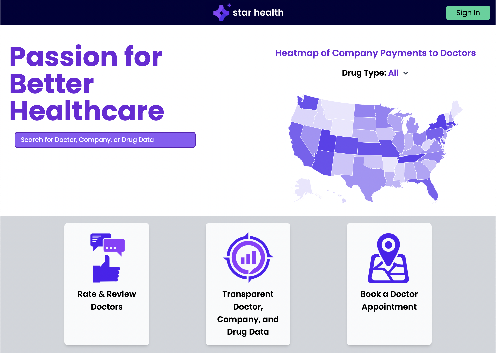
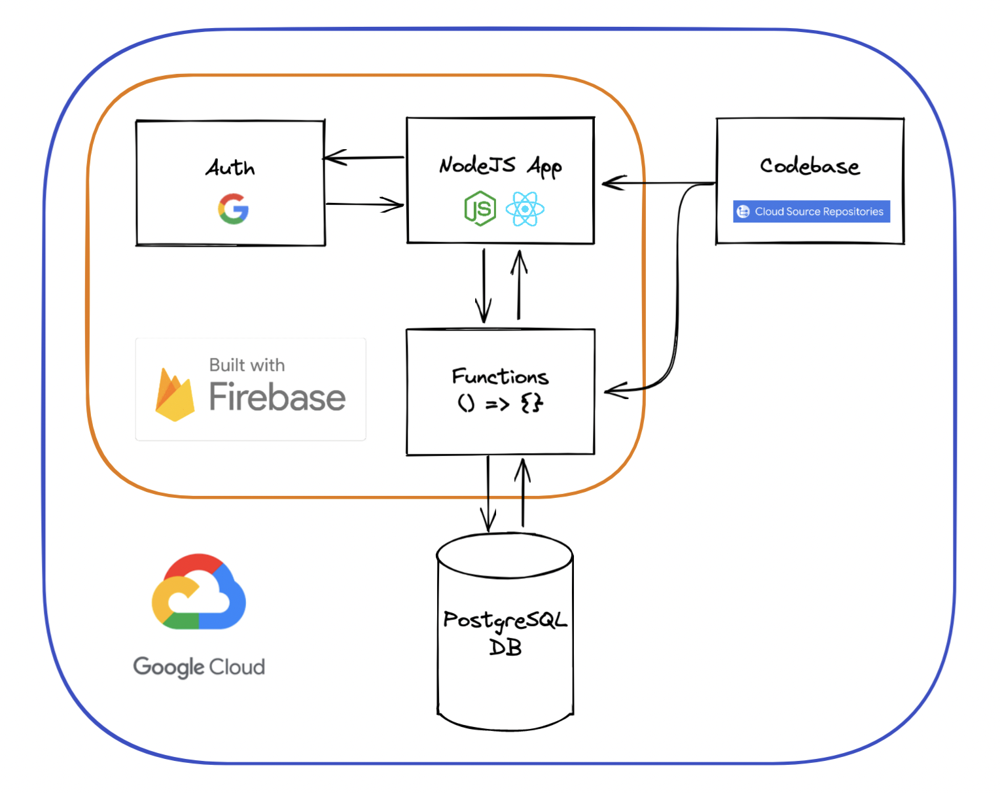
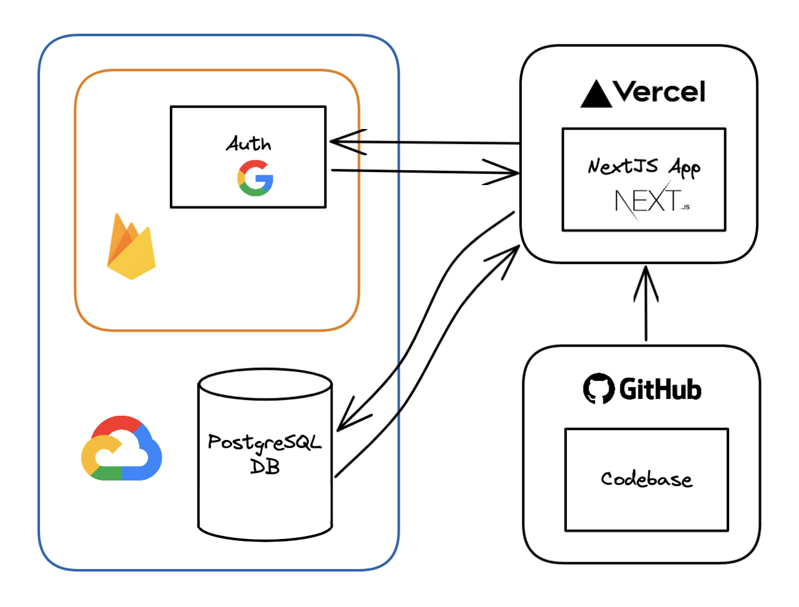

# Star Health

https://starhealth.io/

Star Health is a public data analytics platform focused on healthcare. It strives to make public medical data more accessible to the general public.




## Architecture

The platform consists of:
- [Next.js](https://nextjs.org/) app housed on [GitHub](https://github.com/nedink/star-health-t3) and hosted on [Vercel](https://vercel.com/), described [below](#app)
- [PostgreSQL](https://www.postgresql.org/) [database](https://console.cloud.google.com/sql/instances/starhealth/overview?project=starhealth-io)
- [Google Authentication](https://firebase.google.com/docs/auth)
- [Google Cloud Platform project](https://console.cloud.google.com/welcome?project=starhealth-io)
- [Firebase project](https://console.firebase.google.com/project/starhealth-io/overview)

[Jump to current architecture diagram](#current-architecture)

## App

This is a [T3 Stack](https://create.t3.gg/) project bootstrapped with `npx create-t3-app@latest`.

- [Next.js](https://nextjs.org)
- [NextAuth.js](https://next-auth.js.org)
- [Prisma](https://prisma.io)
- [Tailwind CSS](https://tailwindcss.com)
- [tRPC](https://trpc.io)

To learn more about the [T3 Stack](https://create.t3.gg/), take a look at the following resources:

- [Documentation](https://create.t3.gg/)
- [Learn the T3 Stack](https://create.t3.gg/en/faq#what-learning-resources-are-currently-available) — Check out these awesome tutorials

## Quick Start

>This project requires [Node.js](https://nodejs.org/en/) and [Git](https://git-scm.com/). Make sure they are installed in your local development environment. You can check that they are by running:
>```
>git --version
>
>node --version
>```

1. Clone the project and navigate into it.
```
git clone https://github.com/nedink/star-health-t3.git

cd star-health-t3/
```

1. Install packages.
```
npm ci
```

1. Run in development mode.
```
npm run dev
```

1. Open in browser at http://localhost:3000/.
```
> star-health-t3@0.1.0 dev
> next dev

ready - started server on 0.0.0.0:3000, url: http://localhost:3000
```


## Development

Check the [technology stack](#app) listed above and review the documentation for these as needed.

### File Structure
```
root
|_ prisma/
|  |_ schema.prisma
|
|_ src/
|  |_ assets/
|  |_ components/
|  |_ env/
|  |_ pages/
|  |  |_ DoctorDetials/, DoctorReviews/...
|  |_ server/
|  |  |_ common/, db/, trpc/router/ <- db.ts is in here, which defines trpc queries that use Prisma to CRUD the database. This needs to be modified for most new features.
|  |_ styles/
|  |_ types/
|  |_ utils/
|  |_ ...
|
|_ .env <- This contains secrets/keys, and is not tracked by Git. Ask a teammate to send you a copy of theirs.
|_ package.json
|_ ...config files (Next.js, TypeScript, Tailwind, etc.)
```

### Rough Developer Workflow

1. For any significant change, create a new branch with an appropriate name, i.e. `hotfix/doctor-page`. Commit messages should be short and descriptive, i.e. `fix dropdown behavior`.

1. Before committing, review your changes. Remove temporary code you may have written for debugging purposes (like print statements), and try to avoid comitting large sections of reformatted/whitespace-only changes on pre-existing code, unless that is the nature of your update. 

    > Cleaning up and reformatting is important for a good developer experience however, so feel free to take a pass at reformatting between features or fixes!

1. After you commit, watch for the result of the build process for the `preview` deployment in Vercel. If the build fails, review the log output and debug until the build is successful. 

1. Open a [pull request](https://github.com/nedink/star-health-t3/pulls) to `main` and request review from a teammate.

1. On merges/changes to `main`, the app will be deployed to `production`. Make sure the build is successful here as well.
    > Unless otherwise instructed, you are responsible for seeing your changes through to production. Likewise, your team is responsible for reviewing your changes and helping to move them forward.
    >
    >This means that you might have a PR open and waiting for review while you continue to work on other features in parallel, but don't forget about it!

The steps described above cover _most_ cases for implementing code changes. However, some steps may be expedited or skipped with permission from the team or leadership. Ultimately, these steps are meant to smooth and add consistency to the development process, not hinder it.


## Migration from GCP

The goal of this effort is to move out of GCP in favor of more modular, light-weight solutions like GitHub and Vercel.

Initially, the codebase, database, authorization, app and function deployements were built for and hosted on GCP + Firebase:

### Legacy Architecture


(Dec 19, '22) The code and app deployments have been moved to GitHub and Vercel:

### Current Architecture


[Jump to tech stack list](#architecture)


## Repeatable Steps for Migrating Data - The Manual Way

Steps we took to migrate the data to a new schema (as of Dec 19 '22):
1. Update the [prisma.schema](prisma/schema.prisma) file with desired changes (add models, attributes, indexes, etc.).
1. Create a new empty database under the [`starhealth` instance](https://console.cloud.google.com/sql/instances/starhealth/databases?project=starhealth-io)
1. Set your `DATABASE_URL` in your local `.env` to point to the new database.
1. At the root of the project run `npx prisma db push` to update the remote database. This adds the tables + relationships defined in the schema file. If any potential for data loss, this command will throw an error. [Documentation](https://www.prisma.io/docs/concepts/components/prisma-migrate/db-push)
1. Download/export the data from the old database as CSV files ([pgAdmin](https://www.pgadmin.org/) among others will let you do this) - make sure that you set it to use the double-quote `"` for both the __Quote__ and __Escape__ characters in export options.
1. Use scripts to transform this data into files that match the tables in the new schema. [Some scripts to help with this](https://github.com/nedink/csv-scripts)
1. Copy your updated CSV files into the new database you created. For example, you can use `psql` and the `\copy` command:
    ```
    psql -h '[db host/IP]' -p [5432] -d dbname -U username -W

    Password: (type the password)

    dbname=> \copy "TableName" FROM './TableFile.csv' DELIMITER ',' CSV
    ```
    >^ This assumes there is no header in the file
1. Back at the project root, run `npx prisma generate` the to regenerate the Prisma client, allowing you to make queries from within the app. (This introspects your `schema.prisma` file, it does not depend on the remote database.) [Docs,](https://www.postgresql.org/docs/current/app-psql.html) [more docs,](https://www.postgresguide.com/utilities/psql/) [tutorials](https://tomcam.github.io/postgres/)


## Additional Resources

[t3 Vercel deployment docs](https://create.t3.gg/en/deployment/vercel)
